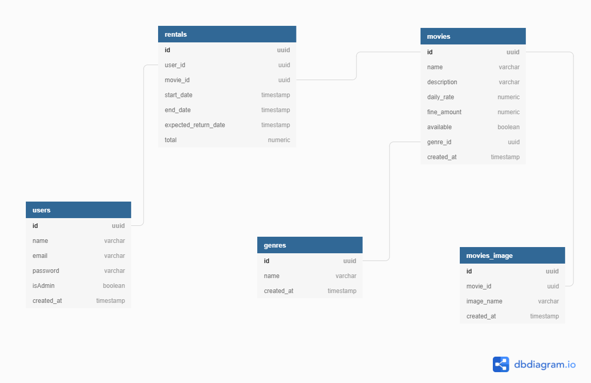

# Movie rental program

## Technologies used
- Node.js
- Typescript
- Yarn
- Express
- JWT
- Prisma
- Jest
- SQLite

## Functionalities
Project functionalities [functionalities](./functionalities.md)

## Skills developed
- Creation of database diagram
- Business rule creation and functionalities
- User authentication
- Addiction injection with the tsyringe

## Diagram
